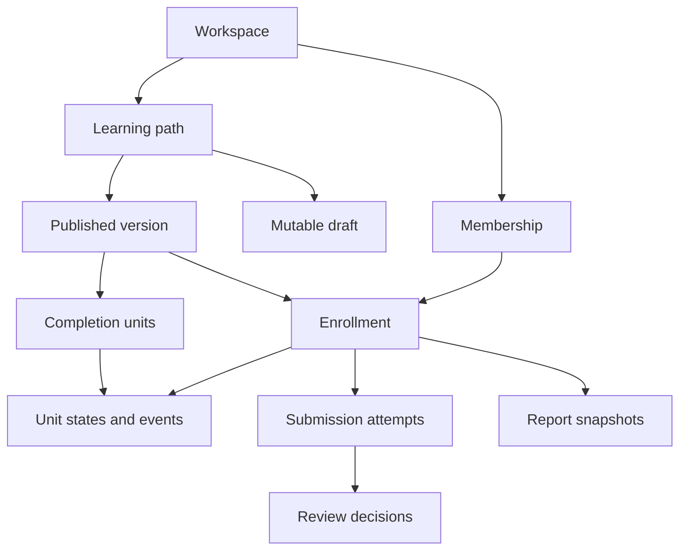

# Domain Model

Status: proposed baseline. “Enrollment” is the canonical participation entity; organization assignment is a command that creates it. There is no second independent AssignmentProgress engine.

## Bounded contexts

| Context | Owns | Must not own |
| --- | --- | --- |
| Identity | Auth users, sessions, credentials, verification | Workspace business roles |
| Workspaces | Workspace, Membership, Invitation, ManagerLearner | Published content or private notes |
| Content | LearningPath, PathDraft, PathVersion, ContentNode, CompletionUnit, ImportRun | Per-user completion |
| Learning | Enrollment, UnitState, ProgressEvent, StudySessionRevision, PrivateNote | Editable path definitions |
| Evidence | SubmissionAttempt, AttemptAttachment, ReviewDecision | Overall report formatting |
| Reporting | ReportSnapshot and render inputs | Invented skills/AI narratives |
| Infrastructure | FileObject, OutboxEvent, JobRun, delivery receipts | Permission decisions hidden in UI |

## Entities and ownership

**User** is a global identity. A user can belong to multiple workspaces. Identity lifecycle does not make one workspace's records visible to another.

**Workspace** has type personal/organization, name, default timezone and optional logo. A personal workspace has exactly one active owner membership and no invitation/collaboration. A user's personal workspace is created idempotently after verification. Organizations must retain at least one owner; owner removal/demotion is locked and rejected if it would leave none.

**Membership** links a user and workspace with role and active/removed status. **ManagerLearner** explicitly connects two active memberships in the same organization. A mentor relationship is enrollment-specific through reviewer membership; a mentor need not be a manager.

**Invitation** contains target verified email, permitted role, token hash, expiry and state. It grants no access before acceptance. Accepting binds membership atomically; repeated consumption returns the already-created membership to the intended recipient or fails without another grant.

**LearningPath** is a stable identity in one workspace, with archive status and current published version pointer. **PathDraft** is one mutable canonical document with revision counter. **PathVersion** is an immutable snapshot: canonical content hash, sequence, publication actor/time, node records and derived completion units.

**ContentNode** is a typed structural item in one version. Its portable logical ID is unique within a path version, while its database/public UUID identifies the specific snapshot row. Renaming or moving an item preserves its logical ID within the same path. An imported slug is valid as logical identity but is never an authorization credential.

**CompletionUnit** names one explicitly trackable activity and required flag/rule. It references a node in the same version. Containers have no independent credit. Unit derivation is fixed by [Content Model](08-CONTENT-MODEL.md).

**Enrollment** links one active learner membership to one published version, with personal/organization origin, assigned actor, manager membership, optional reviewer and optional deadline. Enrollment stores cancellation separately from completion. Unique learner/version participation is sufficient for MVP; repeated courses/retakes are later scope.

**UnitState** is the current projection for enrollment/unit. **ProgressEvent** is the immutable completion/reopen/approval transition, with event ID, sequence and transaction-assigned occurrence time. The projection is rebuildable and never substitutes for history.

**SubmissionAttempt** belongs to an enrollment/unit, is editable only in draft, and becomes immutable on submission. Attempt numbers increase; requested revisions create another attempt. **ReviewDecision** belongs to one submitted attempt, records reviewer, decision and feedback. Earlier feedback remains attached to its original attempt.

**PrivateNote** belongs to the learner and optionally a content node. Ownership is enforced separately from manager capabilities. **StudySessionRevision** preserves the original interval and corrections for reproducible historical reports.

**ReportSnapshot** stores fixed authorized facts for one enrollment and cutoff, with report schema/progress rule versions. Its generated PDF is a private FileObject. **ActivityEvent** is a sanitized user-facing timeline entry; **AuditRecord** is an administrative history entry. Neither copies private notes or raw evidence bodies unnecessarily.

## Relationships

## Aggregate transaction boundaries

- Publish locks path/draft, validates revision, inserts immutable version/nodes/units, moves pointer and appends audit/outbox in one transaction.
- Enroll checks membership/relations/rules and creates one enrollment with initial state in one transaction.
- Complete/reopen locks enrollment/unit state, validates capability, changes projection and appends event/outbox atomically.
- Submit locks enrollment/unit attempt slot, freezes the draft and queues notification; files must already be accepted.
- Review locks enrollment/unit and current attempt; records decision, updates completion if approved and appends event/audit/outbox atomically.
- Generate report fixes an authorized snapshot under a consistent transaction; PDF is a subsequent idempotent job.

Use explicit commands, not arbitrary object patches, for state transitions. Related records always carry workspace and version constraints. Removal/history policies distinguish revoking access from deleting historical evidence.

## Terminology to avoid

Do not equate learner with student, manager with teacher, path with academic course, submission with exam, or completion with skill. Domain labels and example content must support general training.
