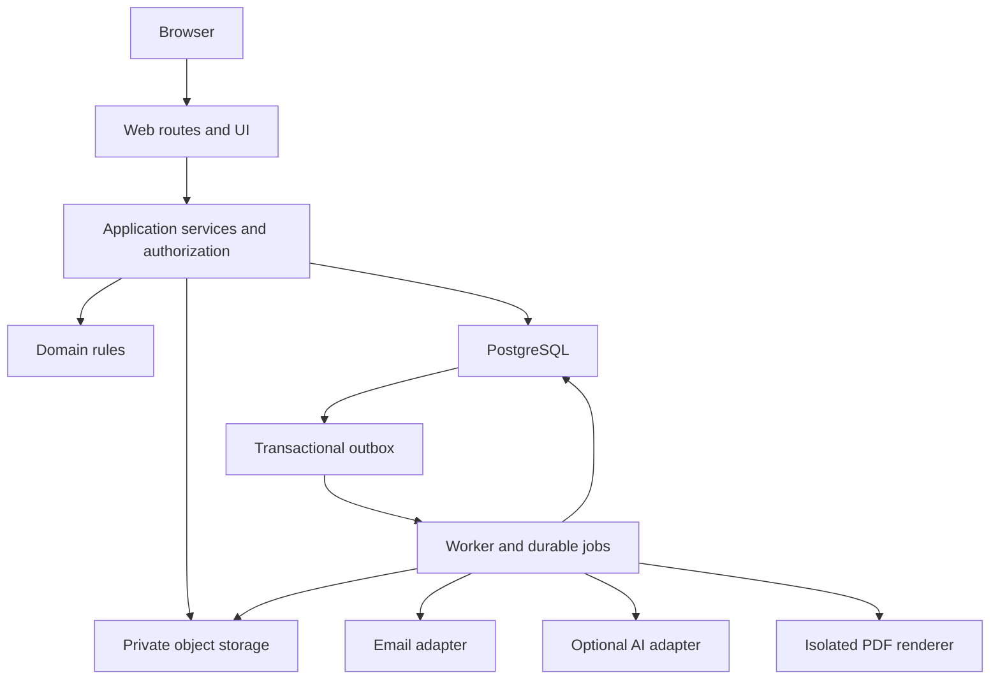

# System Architecture

## Decision

Build a modular monolith with a Next.js/TypeScript web runtime, a separate Node worker process and PostgreSQL. Shared domain/application packages are independent of React. This keeps transaction boundaries simple and operational cost moderate while preserving future mobile/API clients.

## Module boundaries

Domain modules expose commands/queries through application services: workspaces, content, learning, evidence, reporting. Adapters supply auth sessions, SQL repositories, blob operations, email, AI and job delivery. UI consumes typed DTOs; it cannot import repositories or calculate authoritative progress. REST handlers and thin Server Actions use the same service functions. No separate business logic in API and page handlers.

Route processing: parse transport schema → retrieve current database-backed auth session → resolve active membership/workspace → authorize capability and object relationship → enter tenant transaction → execute service/domain validation → map DTO → return. Read models explicitly omit private fields. Framework middleware may improve navigation but is not a security boundary.

Next.js documentation requires authorization within mutation entry points, independently of page checks. This design follows that boundary; see [official data-security guidance](https://nextjs.org/docs/app/guides/data-security).

## Persistence and side effects

PostgreSQL is the source of truth. Mutable drafts use validated JSON plus optimistic revision; published versions use typed relational nodes/units and a frozen canonical snapshot. Current learning projections and immutable transitions coexist. Transactional outbox records make domain changes and notification/job intent atomic without promising exactly-once external delivery.

The outbox dispatcher submits pg-boss jobs using deduplication keys. Worker effects remain idempotent; a crash between provider delivery and receipt can still repeat external delivery. Keep providers' idempotency support when available and describe unavoidable duplicate email risk. Domain completion and report/file association have database uniqueness protections.

Worker jobs are import extraction, optional AI conversion, report PDF/export, email, orphan cleanup and projection maintenance if needed. They contain IDs and minimal metadata, not large private bodies. Authorization is rechecked at execution; report downloads always recheck current access.

## Deployment units

Web container, worker container, PostgreSQL and private S3-compatible storage. Development additionally uses a local email inbox and an S3-compatible local service. Chromium/font dependencies belong to a PDF worker image; do not depend on an edge runtime. Browser renderer receives trusted sanitized snapshot HTML, has no general internet access and cannot browse arbitrary submitted URLs.

AI configuration is optional and server-only. No production functionality is replaced by demo providers. Seed data is isolated to development/test. No shared public caching of tenant pages or private reports in MVP; cache only static assets and safe immutable public framework resources.

## Architectural limits

No microservices, Redis requirement, autonomous agent runtime, external search cluster or mandatory Git backend initially. A modular monolith can serve the beta workload in the MVP spec; load testing and indexes, not topology promises, demonstrate that. A future extraction must preserve shared service contracts and authorization invariants.

## Quality boundaries

Domain tests verify content/progress/state rules without a browser. Database tests use real PostgreSQL roles, RLS and composite constraints. Service integration tests verify authorization and atomicity. E2E tests verify invitations, learning, review and actual PDF downloads. The [test strategy](22-TEST-STRATEGY.md) defines evidence required at each gate.
