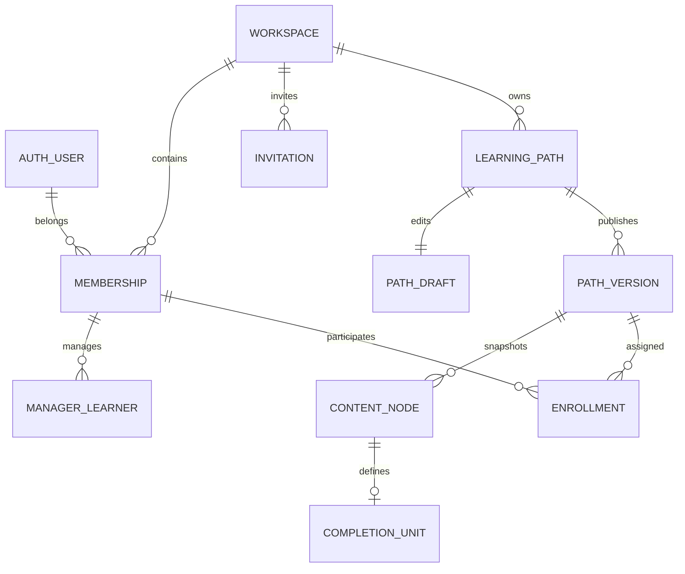
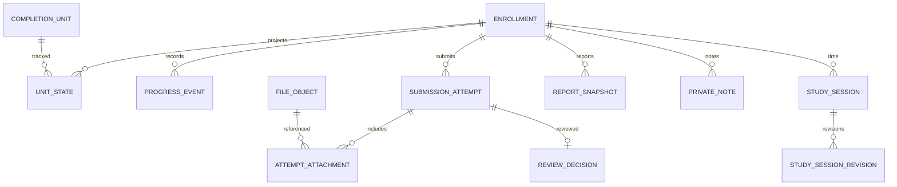

# Database Design and ERD

Status: logical schema specification, not executable migrations. PostgreSQL 18 is the baseline; current compatible minor versions are pinned during Foundation. Authentication table columns come from the pinned Better Auth adapter schema, not an invented parallel password store.

## ERD — workspace and content

## ERD — participation and evidence

## Table contracts

All application rows except global auth tables have `workspace_id`, non-sequential UUID primary/public ID and appropriate timestamps. Foreign identifiers below are UUIDs unless explicitly logical strings. `timestamptz` stores instants; timezone identifiers are IANA names. Nullable flags never substitute for undefined state transitions.

| Table | Essential fields | Constraints / indexes |
| --- | --- | --- |
| workspace | id, type, personal_user_id?, name, timezone, default_locale, logo_file_id? | personal_user_id unique when personal; type/personal_user consistency; default_locale in fa/en, default en |
| membership | id, workspace_id, user_id, role, status | unique(workspace_id,user_id); index(user_id,status); personal single-owner enforced in service/transaction |
| manager_learner | id, workspace_id, manager_membership_id, learner_membership_id, status | unique pair; same-workspace composite FKs; actor cannot self-manage to bypass review |
| invitation | id, workspace_id, email_normalized, role, token_hash, expires_at, status, accepted_membership_id? | unique token_hash; one pending invite per workspace/email; role grant checked server-side |
| learning_path | id, workspace_id, title, archived_at?, published_version_id? | unique(workspace_id,id); published pointer must belong to this path/workspace |
| path_draft | id, workspace_id, path_id, revision, canonical_json, updated_by | unique path_id; revision positive; schema validated before write |
| path_version | id, workspace_id, path_id, version_number, canonical_json, content_hash, published_at, published_by | unique(path_id,version_number); unique(workspace_id,path_id,id); immutable after publication |
| content_node | id, workspace_id, path_version_id, logical_id, parent_node_id?, kind, sort_order, title, body_markdown, resource_url?, metadata_json | unique(version,logical_id); same-version parent; sibling order uniqueness using NULLS NOT DISTINCT for root |
| completion_unit | id, workspace_id, path_version_id, node_id, logical_id, required, rule | unique(version,node_id); unique(version,logical_id); same-version node |
| enrollment | id, workspace_id, learner_membership_id, path_version_id, origin, assigned_by, manager_membership_id?, reviewer_membership_id?, due_at?, cancelled_at?, revision | unique(learner_membership_id,path_version_id); reviewer/manager same workspace; personal constraints checked |
| unit_state | id, workspace_id, enrollment_id, path_version_id, unit_id, state, satisfied_at?, revision | unique(enrollment_id,unit_id); matching enrollment/unit versions via composite FKs |
| progress_event | id, workspace_id, enrollment_id, unit_id?, sequence, kind, actor_membership_id, occurred_at, data_json | unique(enrollment,sequence); index(enrollment,occurred_at,sequence); append-only |
| submission_attempt | id, workspace_id, enrollment_id, path_version_id, unit_id, number, status, body_markdown, submitted_at?, revision | unique(enrollment,unit,number); at most one draft and one active submitted/under_review attempt per unit |
| attempt_attachment | id, workspace_id, attempt_id, file_id | unique(attempt_id,file_id); same-workspace FK; immutable with submitted attempt |
| review_decision | id, workspace_id, attempt_id, reviewer_membership_id, decision, feedback, decided_at | unique attempt_id; decision changes_requested/approved; immutable |
| private_note | id, workspace_id, enrollment_id, owner_user_id, node_id?, body_markdown, revision, deleted_at? | index(owner,enrollment); extra owner RLS; node version validated |
| study_session | id, workspace_id, enrollment_id, owner_membership_id, current_revision_id | parent stable identity; no inferred browser time |
| study_session_revision | id, workspace_id, session_id, revision, starts_at, ends_at, recorded_at, deleted | unique(session,revision); ends>starts; immutable |
| enrollment_change | id, workspace_id, enrollment_id, sequence, changed_at, due_at?, manager_id?, reviewer_id?, cancelled | immutable administrative state history for report cutoff |
| report_snapshot | id, workspace_id, enrollment_id, requested_by, period_start, period_end, cutoff_at, generated_at, report_locale, schema_version, rule_version, model_json, model_hash, pdf_file_id?, state | append-only model/locale; report_locale in fa/en; generation key uniqueness; index(enrollment,generated_at) |
| file_object | id, workspace_id, owner_membership_id, purpose, object_key, original_name, bytes, detected_type, sha256, status, created_at | unique object_key; authorization through binding, not key prefix |
| import_run | id, workspace_id, requested_by, method, state, revision, source_file_id?, source_hash, proposed_json?, provenance_json?, expires_at, confirmed_path_id? | schema-valid proposed_json only; CAS revision; confirmed id written once |
| notification | id, workspace_id, recipient_membership_id, event_id, kind, read_at?, target_id | unique(recipient,event_id,kind); scoped recipient query |
| activity_event | id, workspace_id, enrollment_id, actor, event_id, kind, occurred_at, safe_metadata | unique event_id/kind; no note/evidence body |
| audit_record | id, workspace_id, actor_user_id, action, target_type, target_id, occurred_at, safe_metadata | append-only; index(workspace,occurred_at,id) |
| outbox_event | id, workspace_id, event_type, aggregate_id, payload_json, created_at, dispatched_at?, retries | unique event id; bounded private payload |
| job_run | id, workspace_id, requester_user_id, requester_membership_id?, kind, state, dedupe_key, result_id?, error_code? | unique(workspace,kind,dedupe_key); pg-boss queue records separate infrastructure schema |
| idempotency_record | id, workspace_id, actor_user_id, operation, key, request_hash, result_json, expires_at | unique(workspace,actor,operation,key); no secret values in result |

## Relational isolation

Identity user's adapter-managed metadata additionally stores nullable preferred_locale (fa/en). This allowlisted global UI preference contains no tenant content/role and is the explicit exception to global identity-only schema scope; only that authenticated user can update it. Foundation verifies supported auth schema extension/migration rather than inventing a second identity store. Locale selection never changes authorization.

Every referenced tenant parent exposes a unique composite key `(workspace_id,id)`. Child FKs carry the same workspace. Version-sensitive joins use additional version keys: UnitState references both `(workspace_id,enrollment_id,path_version_id)` and `(workspace_id,path_version_id,unit_id)`. Attempts use the same pattern. A database cannot accept an Organization A enrollment pointing to Organization B content or a v1 enrollment referencing a v2 unit.

Parent ContentNode FK includes workspace/version; domain validation also rejects cycles and illegal kinds. Use parameterized SQL, not string interpolation. Unique constraints are final concurrency barriers, not substitutes for application authorization. See [PostgreSQL constraints](https://www.postgresql.org/docs/current/ddl-constraints.html) for multicolumn foreign-key support.

## Mutation restrictions

Application runtime is non-owner, non-superuser, without BYPASSRLS or DDL grants. Published versions/nodes/units, events, decisions and session revisions cannot be updated/deleted by general application commands. Use SQL grants plus immutability triggers where appropriate. Insert published children only while a publication transaction builds a new version; finalize a sealed flag before pointer publication. A trigger rejects later child inserts into sealed versions. Model/PDF status fields may change through narrowly controlled report delivery operations, not model rewrites.

Schema migrations use a separate privileged identity. Auth storage uses its own adapter connection/permissions. Worker roles have only needed queue and tenant privileges; execution still goes through context-bound repositories.

## Index/query plan

Index enrollment(workspace,manager,learner), pending attempts(workspace,status,submitted_at,id), membership(user,status), nodes(version,parent,order), states(enrollment,unit), report(enrollment,generated_at,id), timeline(enrollment,occurred_at,id). Cursor pagination uses timestamp+UUID or stable sortable pairs, never unbounded lists. Explain representative dashboard/report queries on seeded beta workloads to prevent N+1 queries.

## Migrations and deletion

Migration filenames are ordered and committed. Test empty install and upgrade from previous schema; never use schema-push to mutate production. Use expand/contract where running versions overlap. Operational queues have independently pinned migrations.

Soft-archive paths and revoke memberships without cascading learning history. Permanent deletion/export requests use a documented controlled retention workflow; ordinary UI never issues cascade deletes of reports/evidence. [Security](13-SECURITY.md) and [operations](23-DEVELOPMENT-AND-DEPLOYMENT.md) define provisional retention and cleanup obligations.
