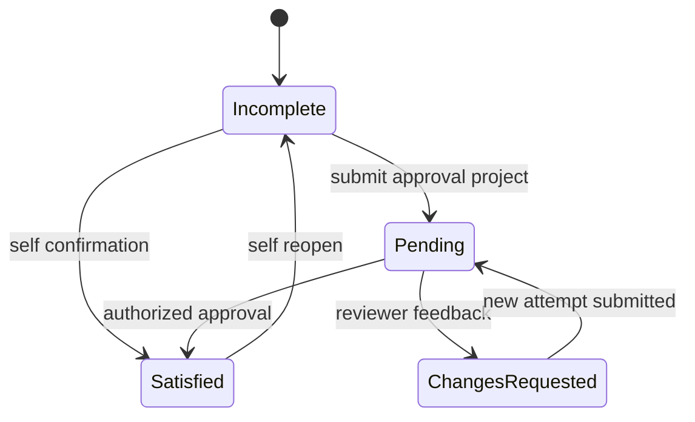

# Progress and Completion Engine

## Derivation

At publish time validate [content rules](08-CONTENT-MODEL.md) and derive one CompletionUnit for each non-null completion field. Required units form the denominator fixed by PathVersion. Containers, resources and aggregated lessons add no units. Required/optional and rule are immutable in the published version.

`progress = satisfied_required / total_required * 100`. Display rounded percentage, but retain exact integer numerator/denominator for calculations and reports. Zero required units blocks publication; a zero-required subtree is labeled optional/reference. Never average rounded child percentages.

## State transitions

State is scoped to enrollment/unit. Draft evidence alone is not pending review and does not affect completion. Starting/reading a lesson creates activity, not completion. Personal projects self-confirm after optional evidence submission; organization projects with approval rule require an eligible approved attempt. Learner cannot mark such a project complete.

## Command transaction

Authenticate, establish tenant/membership, load enrollment/version/unit, check rule and actor, lock enrollment then UnitState in a consistent order, check expected revision and idempotency record, perform transition, insert immutable ProgressEvent with next enrollment sequence, update projection and enrollment completion-cycle metadata, append safe timeline/outbox, commit. Assign server occurrence time after lock acquisition. Same-state repeated requests are no-op success when intent matches; inconsistent stale state returns conflict.

Approval transaction also locks the latest eligible submitted attempt. ReviewDecision uniqueness and expected attempt revision prevent two reviewers from double-counting or overwriting feedback. Self-review fails for all roles. Attempt status/decision/unit transition are one atomic commit. Queue delivery is outside that commit through the outbox.

## Completion cycles and dates

The enrollment becomes complete when all required units are satisfied. Record the cycle's completed_at. Reopen of a required self-rule unit clears current completed_at and emits PATH_REOPENED; previous cycle completion remains in events. Reopen of optional work does not reopen the path. Re-completion records another cycle. Historical reports replay state/cycle as of cutoff and use deadline from enrollment_change at that cutoff.

Approved projects are immutable in MVP. Learner cannot reopen them, change submitted evidence or reverse a decision. A future audited correction policy is needed before reversal/retakes.

## Study sessions

User enters start/end with timezone-aware UI; store UTC instants plus display timezone preference. Positive duration, no future end and maximum 24 hours per session are initial validation rules. Sessions for the same learner/workspace may not overlap across enrollments; serialize writes with learner-membership lock and query interval overlap. Correcting/deleting creates immutable StudySessionRevision rather than rewriting history.

No timer or attention detection. Report labels time self-reported and chooses latest revision recorded at or before report cutoff. A backdated session recorded after that cutoff is excluded from historical-as-of reporting; expose this fact in report help text. A current report includes it if cutoff permits.

## Rebuild and calculations

Events are append-only factual transitions. UnitState is a projection; a maintenance command can replay events in per-enrollment sequence under lock and compare it to the current projection. This is not full event sourcing for every application field. Report models reconstruct old state from events rather than current percentages.

Test required/optional aggregation, pending/changes/approved, reopen cycles, duplicate/stale commands, review races, zero denominator, mixed container sizes, immutable version changes, boundaries and outbox failure. Examples include four required units where one approval is pending: three satisfied means 75%, never 100%.
