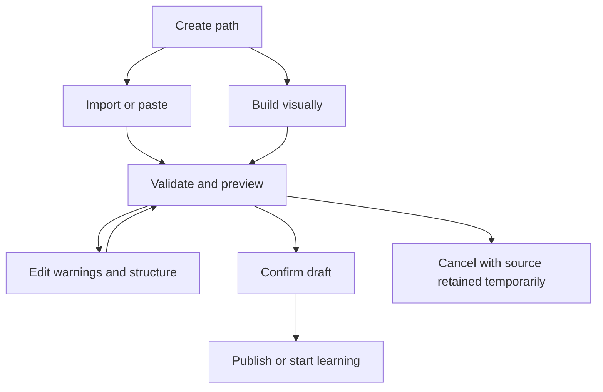

# UI/UX Flows and Page Responsibilities

The MVP ships complete selectable Persian (fa, RTL) and English (en, LTR) interfaces, including authentication, organization/personal workflows and report labels. Organization administration appears only within organization workspaces. Accessible responsive behavior is P0; dark mode/command palette/graphs and additional translated locales are later.

## Multilingual experience — P0

All visible product strings use stable translation keys: navigation, forms, validation/errors, permission-denied states, empty/loading/conflict states, notifications, auth/invitation emails, report/print/PDF labels and accessible names. User-authored titles, source text, feedback and notes are content; changing interface language never machine-translates or overwrites them. Content direction uses its language/auto direction separately from the surrounding shell. Code, URLs and technical identifiers stay LTR where necessary.

Language selector is available before login and in account settings, using native labels فارسی and English rather than national flags. Resolution order: explicit supported locale URL/session selection; saved authenticated user preference; pre-login locale cookie; best supported browser language; English fallback. A saved explicit choice is not overridden by browser detection. Persist signed-in preference globally on the identity user's allowlisted UI metadata, independently of workspace membership/permissions. Set cookie for pre-login continuity; server resolves the same locale before initial render to avoid hydration/direction flashes.

Localized page URLs use `/fa/...` and `/en/...`; auth/API routes remain stable and unprefixed. Switching updates the page locale and saved preference, retaining current object, filters and unsaved form text. A locale preference conveys no access rights and cannot modify another user's settings. HTML lang/dir, CSS logical properties, icons/navigation flow, focus order and mobile layout follow locale; do not mirror code/media indiscriminately.

Use locale-aware formatting for numbers, plural messages, dates and durations. Display timezone remains an independent preference; choosing Persian must not silently change timezone or stored UTC instants. Gregorian calendar is the MVP baseline, with unambiguous localized labels; a Jalali calendar selector is separate future scope. Request IDs, JSON enum values, UUIDs and ISO timestamps remain stable language-neutral machine values.

Emails use intended recipient's saved locale; invitations to users with no known preference use workspace default locale (en unless owner changes it). Snapshot report request exposes fa/en report locale, defaulting to requester preference, and freezes that locale with the report model. Changing UI language later cannot rewrite a previously generated PDF. In-app notification events store stable keys/arguments and render in recipient's current locale.

Maintain complete fa/en message catalogs with matching keys/placeholders/plural branches; no concatenated sentences. Missing keys fail CI for required locales; runtime fallback to English is a last-resort recovery, not accepted translation completeness. Additional supported languages can be installed with catalogs, direction/configuration and the same QA gates, without changing content/domain records.

Release gate: complete personal and employer/review journeys in both locales, localized auth/invite email checks, keyboard/mobile RTL layout, locale persistence across sign-out/in, unchanged unsaved drafts and fixed bilingual PDF labels. Translation readiness alone does not satisfy this requirement.

## Navigation

Personal: Home, My learning, Paths, Projects, Timeline, Reports, Notes, Settings. Organization learner: Home, My learning, Submissions, Timeline, Reports, Notes. Organization manager/owner: Dashboard, People, Learning paths, Assignments, Reviews, Reports, Settings. Assigned mentor: Reviews and Assigned learners plus contextual published content. Use role capability checks to simplify navigation, while backend remains authoritative.

Workspace selector clearly identifies personal versus organization and never carries object IDs from one into another. A user can belong to multiple organizations. “Create organization” is optional after personal onboarding, not required before learning.

## Creation flow

Choose input method, then extraction mode if AI is enabled. Hide internal IDs/YAML unless advanced mode is requested. Show tree, unit counts, source/unmapped coverage and estimated fields as suggested. The preview supports inline edit and batch completion-rule changes with before/after counts. Confirmation and publishing labels identify their effect; “Create” cannot secretly assign to all members.

Personal Start learning combines reviewed publish+self-enroll atomically or coordinates idempotent commands with recovery. Organization publication returns path page with Assign action. Approval projects incompatible with personal mode show a batch “Use self-confirmation” preview, never silently change rules.

## Page contracts

| Page | User question | Essential content/action |
| --- | --- | --- |
| Learner home | What should I work on next? | Continue next unfinished self-unit/project, deadline, pending review, exact progress |
| Path builder | What will learners receive? | Structured editor, source/preview, validation, revision, publish |
| Learning view | What do I need to do here? | Content, required/optional tasks, resources, completion or evidence action |
| People | Who is in my workspace? | Active members, roles, managed relationships, invitations within capability |
| Assignment | What version and expectations apply? | Learner, published version, manager/reviewer, optional deadline, save |
| Reviews | What requires a decision? | Authorized pending attempts, context/evidence, changes/approve with feedback |
| Learner detail | How is this learner progressing? | Allowed enrollments, exact progress, evidence/review, reports; no private notes |
| Reports | What happened in this period? | Enrollment/period/timezone selectors, factual preview, generate/download states |
| Notes | What did I record privately? | Own notes only, clear privacy label |

## State handling

Every async flow has pending/success/failure/cancel/retry states; no endless spinner. Draft autosave displays saved/retry/conflict, preserves local text until acknowledged and uses expected revision. Cross-tab conflict offers reload and copy unsaved changes; automated merge is not promised. Submission distinguishes Save draft and Submit for review. Review approval requires purposeful action but no unnecessary multi-step confirmation; feedback required for changes requested.

Empty states have one useful next action. Zero required units explains why publishing is blocked. No recorded time says “No study time recorded.” Pending review does not suggest learner can complete it. Due/overdue status respects user timezone and pinned assignment deadline.

## Accessibility and mobile

Semantic headings, labels, inline errors associated with inputs, focus after validation, keyboard move controls, visible focus and adequate contrast. Tree builder must be usable without drag/drop. Mobile learning uses readable line lengths, sticky minimal continuation controls and file submission without hover. Code and tables can scroll independently; Persian content sets direction at content block level while technical code stays LTR.

Reports use stable print layout and mixed-direction fonts. No placeholder charts; use numeric fraction/progress bar only if factual data exists. UX acceptance includes creation by a nontechnical tester without reading YAML/domain documentation.
